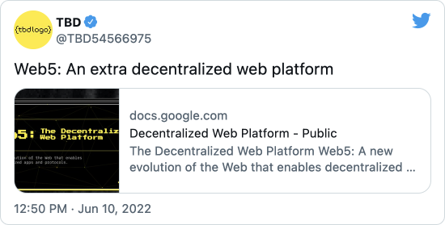

A little over two weeks ago [TBD](https://www.tbd.website) announced their [Web5](https://developer.tbd.website/projects/web5/) project that aims to develop and release a set of open source development kits that enable a user-centric decentralized web that puts users back in control of their identity and data.

[](https://twitter.com/TBD54566975/status/1535303403361824768)

TBD has committed to developing all of their projects in public, transparent and open source manner, and to that end, have already published several early versions of the Web5 projects to GitHub.

<details>
<summary><b>Self-Sovereign Identity SDK</b></summary>

"Standards-based primitives for using Decentralized Identifiers and Verifiable Credentials"

[GitHub](https://github.com/TBD54566975/collaboration)
</details>

<details>
<summary><b>Self-Sovereign Identity Service</b></summary>

"An in-a-box service that handles the full Verifiable Credentials lifecycle, including issuance, verification, revocation, and more."

[GitHub](https://github.com/TBD54566975/ssi-service)
</details>

<details>
<summary><b>Decentralized Web Node (DWN) SDK</b></summary>

"An implementation of the Decentralized Identify Foundation's emerging decentralized personal datastore standard."

[GitHub](https://github.com/TBD54566975/dwn-sdk-js)
</details>

<details>
<summary><b>tbDEX Protocol</b></summary>

Sandbox of projects as the TBD iterates on the development of a robust protocol, including the tbDEX protocol library, a mock implementation of a PFI (Participating Financial Institution), and a DID library.

[GitHub](https://github.com/TBD54566975/tbdex-protocol)
</details>

# Tutorial Overview

This tutorial will focus on the [Self-Sovereign Identity Service](https://github.com/TBD54566975/ssi-service) (SSIS) project, which is a RESTful web service that leverages the [Self-Sovereign Identity SDK](https://github.com/TBD54566975/ssi-sdk) (SSI SDK).  The SSIS will eventually incorporate a broad range of functionality relating to interaction with [DIDs](https://www.w3.org/TR/did-core/), [Verifiable Credentials](https://www.w3.org/TR/vc-data-model), and [Decentralized Web Node](https://identity.foundation/decentralized-web-node/spec/) (DWN) messaging, but  as of the publication of this post, only the following features have been implemented in the code base:

- DID Management
- Verifiable Credential Schema Management
- Mock Verifiable Credential Issuance & Verification

As a result, the tutorial will only cover the following:

- How to build and run the SSI Service locally
- How to create a DID key with SSIS
- How to create a verifiable credential schema with SSIS
- How to issue a verifiable credential with SSIS

Environment used when creating this tutorial:

- macOS 12.4
- go 1.18.3
- Mage Build Tool 1.13.0
- Docker Engine 20.10.11
- Docker Compose 1.29.2

# Build and Run the SSI Service Locally

Begin by cloning the TBD SSI Service repo to a local working directory:

```sh file=./workflows/build-01.sh
```

The SSI Service is packaged as a Docker container and a Docker Compose file is included to make it simple to run the service locally.  Change to the project's build directory and start the service on port 8080.

```sh file=./workflows/build-02.sh
```

You can confirm the SSI service and sub-services are functioning by checking the health and readiness endpoints:

```sh file=./workflows/build-03.sh
```

    {"status":"OK"}

```sh file=./workflows/build-04.sh
```

```json
{
    "status": {
        "status": "ready",
        "message": "all service ready"
    },
    "serviceStatuses": {
        "credential": {
            "status": "ready"
        },
        "did": {
            "status": "ready"
        },
        "schema": {
            "status": "ready"
        }
    }
}
```

# Create DID Keys

Decentralized Identifiers (DIDs), as defined in the [proposed DID specification](https://www.w3.org/TR/did-core/), are a type of globally unique identifier generated by individuals and organizations that are foundational to TBD's vision for Web5.

Implementers of the DID spec can define new DID methods in their own specifications that detail how DIDs and DID documents are created, resolved, updated, and deactivated.  DID methods are often assocaited with a [verifiable data registry](https://www.w3.org/TR/did-core/#dfn-verifiable-data-registry) and the method specification ensures different implementations of the same DID method are interoperable.

Presently, the SSI Service main branch only supports one DID method, [did:key](https://w3c-ccg.github.io/did-method-key/), for static cryptographic keys.  You can verify this by querying the service:

```sh file=./workflows/create-did-01.sh
```

```json
{
    "didMethods": [
        "key"
    ]
}
```

The commands below create two DIDs using different public-key cryptography algorithms.

```sh file=./workflows/create-did-02.sh
```

```json
{
    "did": {
        "@context": "https://www.w3.org/ns/did/v1",
        "id": "did:key:z6MkjbAqF37PNPNXBdrZw4Bsk6PjCCmFi8CcVCo9VNr3ACDR",
        "verificationMethod": [
            {
                "id": "#z6MkjbAqF37PNPNXBdrZw4Bsk6PjCCmFi8CcVCo9VNr3ACDR",
                "type": "Ed25519VerificationKey2018",
                "controller": "did:key:z6MkjbAqF37PNPNXBdrZw4Bsk6PjCCmFi8CcVCo9VNr3ACDR",
                "publicKeyBase58": "68unenrx2qt4591sFVE2tzqjNdVQJExFoBtDf6t2EyS3"
            }
        ],
        "authentication": [
            [
                "#z6MkjbAqF37PNPNXBdrZw4Bsk6PjCCmFi8CcVCo9VNr3ACDR"
            ]
        ],
        "assertionMethod": [
            [
                "#z6MkjbAqF37PNPNXBdrZw4Bsk6PjCCmFi8CcVCo9VNr3ACDR"
            ]
        ],
        "keyAgreement": [
            [
                "#z6MkjbAqF37PNPNXBdrZw4Bsk6PjCCmFi8CcVCo9VNr3ACDR"
            ]
        ],
        "capabilityDelegation": [
            [
                "#z6MkjbAqF37PNPNXBdrZw4Bsk6PjCCmFi8CcVCo9VNr3ACDR"
            ]
        ]
    },
    "privateKeyBase58": "6QQwGxkm6bTjK2dBCGqjC2K9n6uW1ptGWzRxuTZpyWbkEjZMUQt5eTKxEjgkJyz4usysZ1QAMWHo6zaoBL5eaYnUDWJThhMKZ2NigUEcTqw77p3cPDWeEHSrLVf"
}
```

```sh file=./workflows/create-did-03.sh
```

```json
{
    "did": {
        "@context": "https://www.w3.org/ns/did/v1",
        "id": "did:key:zQ3sheEFdrQ7vRt1SvLPbajJ4SQoCdwt6coEUd1YF2Q1xtb8Q",
        "verificationMethod": [
            {
                "id": "#zQ3sheEFdrQ7vRt1SvLPbajJ4SQoCdwt6coEUd1YF2Q1xtb8Q",
                "type": "EcdsaSecp256k1VerificationKey2019",
                "controller": "did:key:zQ3sheEFdrQ7vRt1SvLPbajJ4SQoCdwt6coEUd1YF2Q1xtb8Q",
                "publicKeyBase58": "tH6d1FeT7EnZgEiBCeR1cpRkzBh8LFBwh5nSj4Lqg7Gg"
            }
        ],
        "authentication": [
            [
                "#zQ3sheEFdrQ7vRt1SvLPbajJ4SQoCdwt6coEUd1YF2Q1xtb8Q"
            ]
        ],
        "assertionMethod": [
            [
                "#zQ3sheEFdrQ7vRt1SvLPbajJ4SQoCdwt6coEUd1YF2Q1xtb8Q"
            ]
        ],
        "keyAgreement": [
            [
                "#zQ3sheEFdrQ7vRt1SvLPbajJ4SQoCdwt6coEUd1YF2Q1xtb8Q"
            ]
        ],
        "capabilityDelegation": [
            [
                "#zQ3sheEFdrQ7vRt1SvLPbajJ4SQoCdwt6coEUd1YF2Q1xtb8Q"
            ]
        ]
    },
    "privateKeyBase58": "7vEnHGiuo2VFpp"
}
```

You can retrieve the DID document associated with one of DIDs we just created  using the [/v1/dids/key](localhost:8080/v1/dids/key/did:key:zQ3sheEFdrQ7vRt1SvLPbajJ4SQoCdwt6coEUd1YF2Q1xtb8Q) endpoint.  For example:

```sh file=./workflows/create-did-04.sh
```

```json
{
    "did": {
        "@context": "https://www.w3.org/ns/did/v1",
        "id": "did:key:zQ3sheEFdrQ7vRt1SvLPbajJ4SQoCdwt6coEUd1YF2Q1xtb8Q",
        "verificationMethod": [
            {
                "id": "#zQ3sheEFdrQ7vRt1SvLPbajJ4SQoCdwt6coEUd1YF2Q1xtb8Q",
                "type": "EcdsaSecp256k1VerificationKey2019",
                "controller": "did:key:zQ3sheEFdrQ7vRt1SvLPbajJ4SQoCdwt6coEUd1YF2Q1xtb8Q",
                "publicKeyBase58": "tH6d1FeT7EnZgEiBCeR1cpRkzBh8LFBwh5nSj4Lqg7Gg"
            }
        ],
        "authentication": [
            [
                "#zQ3sheEFdrQ7vRt1SvLPbajJ4SQoCdwt6coEUd1YF2Q1xtb8Q"
            ]
        ],
        "assertionMethod": [
            [
                "#zQ3sheEFdrQ7vRt1SvLPbajJ4SQoCdwt6coEUd1YF2Q1xtb8Q"
            ]
        ],
        "keyAgreement": [
            [
                "#zQ3sheEFdrQ7vRt1SvLPbajJ4SQoCdwt6coEUd1YF2Q1xtb8Q"
            ]
        ],
        "capabilityDelegation": [
            [
                "#zQ3sheEFdrQ7vRt1SvLPbajJ4SQoCdwt6coEUd1YF2Q1xtb8Q"
            ]
        ]
    }
}
```

# Create a Verifiable Credential Schema

Now that we've created a couple of DIDs we might want to issue a verifiable credential.  While we could move straight to this step, there's an important concept of a [Credential Schema](https://w3c-ccg.github.io/vc-json-schemas/v2/index.html#credential-schema) we need to understand first.

The Credential Schema is a document, including metadata and [JSON Schema](https://json-schema.org), that defines the structure of a verifiable credential so that issuers, holders, and verifiers have a singular understanding of the semantics of the set of claims that comprise the verifiable credential.

For example, here is a credential schema for an email address:

```json
{
    "$schema": "https://json-schema.org/draft/2020-12/schema",
    "description": "Email",
    "type": "object",
    "properties": {
        "emailAddress": {
            "type": "string",
            "format": "email"
        }
    },
    "required": ["emailAddress"],
    "additionalProperties": false
}
```

Here's the API call to create the email credential schema with SSIS using the first DID we created earlier:

```sh file=./workflows/create-vc-01.sh
```

The command output should look like:

```json
{
    "id": "9de4bf6e-8876-4c69-ab2d-727cddbde404",
    "schema": {
        "type": "https://w3c-ccg.github.io/vc-json-schemas/schema/2.0/schema.json",
        "version": "1.0.0",
        "id": "9de4bf6e-8876-4c69-ab2d-727cddbde404",
        "name": "Email",
        "author": "did:key:z6MkjbAqF37PNPNXBdrZw4Bsk6PjCCmFi8CcVCo9VNr3ACDR",
        "authored": "2022-06-27T23:51:45Z",
        "schema": {
            "$id": "email-schema-1.0",
            "$schema": "https://json-schema.org/draft/2020-12/schema",
            "additionalProperties": false,
            "description": "Email",
            "properties": {
                "emailAddress": {
                    "format": "email",
                    "type": "string"
                }
            },
            "required": [
                "emailAddress"
            ],
            "type": "object"
        }
    }
}
```

Let's create another credential schema for a postal address:

```sh file=./workflows/create-vc-02.sh
```

# Issue a Verifiable Credential

[Verifiable Credentials](https://www.w3.org/TR/vc-data-model/) represent statements, or claims, made by an issuer about a subject.  Examples mirror the same types of information that can be represented by physical credentials but with the benefit of being cryptographically secure, machine-readable, and potentially privacy respecting.

We'll use the credential schemas we created to define the contents and structure of a set of claims in verifiable credentials issue using the two DIDs.

We'll start by issuing an email credential:

```sh file=./workflows/issue-vc-01.sh
```

The command output should look like:

```json
{
    "credential": {
        "@context": [
            "https://www.w3.org/2018/credentials/v1"
        ],
        "id": "d7bd7382-cbb0-4a23-92ad-7e9b19399846",
        "type": [
            "VerifiableCredential"
        ],
        "issuer": "did:key:z6MkjbAqF37PNPNXBdrZw4Bsk6PjCCmFi8CcVCo9VNr3ACDR",
        "issuanceDate": "2022-06-28T00:38:04Z",
        "expirationDate": "2022-12-31T05:00:00+00:00",
        "credentialSubject": {
            "emailAddress": "hello@example.com",
            "id": "did:key:z6MkjbAqF37PNPNXBdrZw4Bsk6PjCCmFi8CcVCo9VNr3ACDR"
        },
        "credentialSchema": {
            "id": "9de4bf6e-8876-4c69-ab2d-727cddbde404",
            "type": "JsonSchemaValidator2018"
        }
    }
}
```

We can also issue a verifiable credential using an existing published schema:

```sh file=./workflows/issue-vc-02.sh
```

# Wrap Up

All of the TBD projects are under very active development, so I expect that this tutorial will be out of date quickly.  Hopefully, it helps those who want to dive in early before comprehensive documentation is written.

It is expected that July will bring several major milestones for the code base, so I'll plan on sharing more walkthroughs in the near future.  I'm particularly excited to see the Decentralized Web Node (DWN) updates to start experimenting with building Decentralized Web Applications (DWA).

Happy Hacking!

## Learn more

- TBD website: [https://tbd.website](https://tbd.website)
- Introduction to decentralized identity: [https://identity.foundation/faq/](https://identity.foundation/faq/)
- DID use cases: [https://www.w3.org/TR/did-use-cases/](https://www.w3.org/TR/did-use-cases/)
